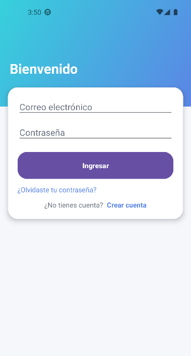
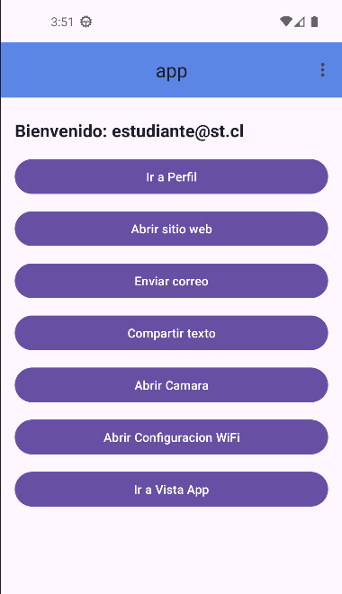
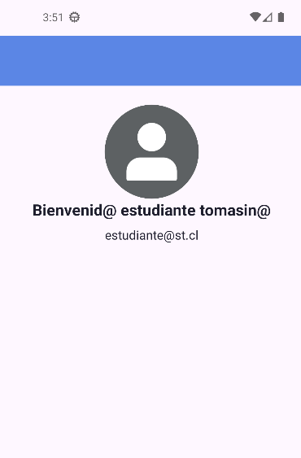
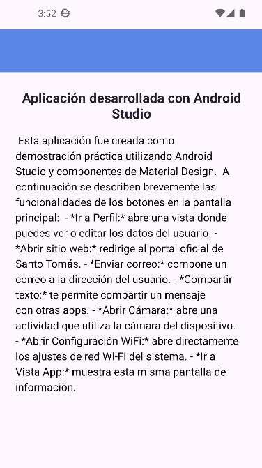

# 📱 Proyecto Android — App Multi‑Intents

**Versión del proyecto:** 1.0  
**Versión mínima de Android:** Android 7.0 (API 24)  
**Versión de Gradle (AGP):** 8.5.0  
**IDE:** Android Studio Giraffe o superior

---

## 🧩 Resumen del proyecto

Esta aplicación fue desarrollada en **Android Studio**, utilizando **Java y Material Design Components**.  
Su objetivo es demostrar el uso de **intents implícitos y explícitos**, así como el manejo del **ciclo de actividades**, menús y permisos básicos.

La app posee una pantalla principal (`HomeActivity`) desde donde se accede a distintas funcionalidades: perfil, cámara, enviar correo, navegador web, compartir texto y configuración de red Wi‑Fi.  
También incluye una pantalla informativa (`AppActivity`) que explica brevemente la estructura y propósito de la aplicación.

---

## ⚙️ Intents implementados

### 🔹 Intents implícitos (5 total)

| Descripción | Acción / URI | Cómo probarlo |
|--------------|--------------|----------------|
| **Abrir sitio web** | `Intent.ACTION_VIEW` + https://www.santotomas.cl | Pulsa **"Abrir sitio web"** para abrir el navegador. |
| **Enviar correo** | `Intent.ACTION_SENDTO` + `mailto:` | Pulsa **"Enviar correo"** para abrir la app de correo con los datos del usuario. |
| **Compartir texto** | `Intent.ACTION_SEND` (text/plain) | Pulsa **"Compartir texto"** y elige una aplicación (por ejemplo WhatsApp). |
| **Abrir cámara** | `Intent.ACTION_IMAGE_CAPTURE` | Pulsa **"Abrir Cámara"** para abrir la cámara del dispositivo. |
| **Configuración Wi‑Fi** | `Settings.ACTION_WIFI_SETTINGS` | Pulsa **"Abrir Configuración Wi‑Fi"** para ir a los ajustes del sistema. |

---

### 🔹 Intents explícitos (3 total)

| Descripción | Destino | Cómo probarlo |
|--------------|----------|----------------|
| **Ir a Perfil** | `PerfilActivity` | Pulsa **"Ir a Perfil (resultado)"**, edita el nombre y vuelve al Home. |
| **Ir a Vista App** | `AppActivity` | Pulsa **"Ir a Vista App"** para ver información del proyecto. |
| **Menú → Perfil** | `PerfilActivity` | Abre el menú superior y selecciona **Perfil**. |

---

## 🧪 Pasos de prueba rápida

1. **Compila y ejecuta la app** desde Android Studio o instala el APK debug.
2. En la pantalla de inicio de sesión (si aplica), accede al **Home**.
3. Prueba los botones uno por uno:
   - **Ir a Perfil:** navega y regresa con datos editados.
   - **Abrir sitio web:** abre una nueva pestaña del navegador.
   - **Enviar correo:** lanza la app de correo.
   - **Compartir texto:** muestra el menú de compartir del sistema.
   - **Abrir Cámara:** activa la cámara del dispositivo.
   - **Abrir Configuración Wi-Fi:** abre los ajustes del sistema.
   - **Ir a Vista App:** muestra información del proyecto.
4. Usa la barra superior (menú ⋮) para acceder a opciones adicionales.

---

## 💻 Fragmentos de código clave

**Intent explícito → PerfilActivity**
```java
Intent i = new Intent(HomeActivity.this, PerfilActivity.class);
i.putExtra("email_usuario", emailUsuario);
editarPerfilLauncher.launch(i);
```

**Recepción de resultado (vuelta al Home)**
```java
private final ActivityResultLauncher<Intent> editarPerfilLauncher =
    registerForActivityResult(new ActivityResultContracts.StartActivityForResult(),
        result -> {
            if (result.getResultCode() == RESULT_OK &&
                result.getData() != null) {
                String nombre = result.getData().getStringExtra("nombre_editado");
                tvBienvenida.setText("Hola, " + nombre);
            }
        });
```

**Intent implícito → Configuración Wi-Fi**
```java
Intent wifiIntent = new Intent(Settings.ACTION_WIFI_SETTINGS);
startActivity(wifiIntent);
```

---

## 🖼️ Capturas de pantalla

Guarda las imágenes en una carpeta `/screenshots` (en la raíz del proyecto) y referencia aquí:

| Pantalla | Imagen |
|-----------|--------|
| Inicio de sesión |  |
| Menú principal |  |
| Perfil del usuario |  |
| Vista App (Información) |  |

> También puedes incluir un **GIF corto** (por ejemplo `screenshots/demo.gif`) mostrando la navegación general.

---

## 📦 APK debug

El archivo se genera automáticamente al compilar:

```
app/build/outputs/apk/debug/app-debug.apk
```

### 🔧 Compilación manual (Android Studio)

1. En el menú: **Build → Build Bundle(s) / APK(s) → Build APK(s)**.
2. Espera el mensaje: *“APK(s) generated successfully”*.
3. Haz clic en “Locate” para abrir la carpeta que contiene tu `.apk`.

---

## 💡 Requisitos técnicos

- **Lenguaje:** Java 17
- **SDK mínimo:** 24 (Android 7.0)
- **SDK de compilación:** 34
- **Dependencias principales:**
   - AndroidX AppCompat
   - Material Components
   - Activity / Fragment KTX
- **Diseño:** MaterialToolbar + NestedScrollView + LinearLayout

---